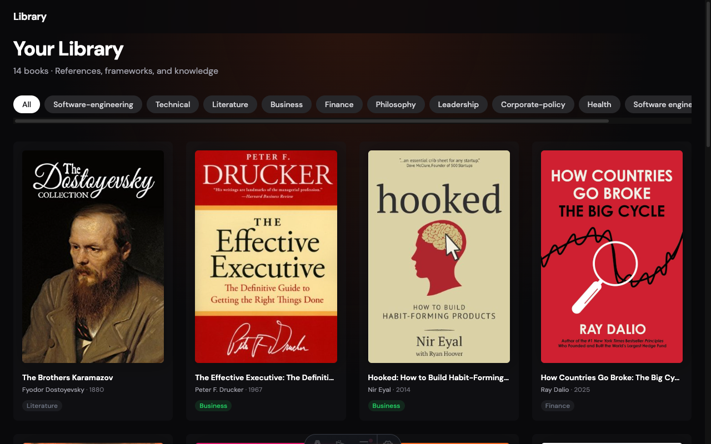
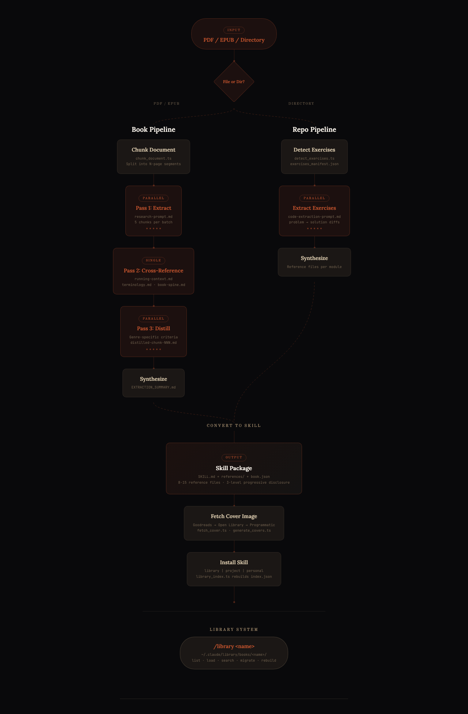

# content-to-skill

Transform PDFs and EPUBs into Claude Code Agent Skills.

Chunks documents, extracts knowledge in parallel, and synthesizes structured skill packages with progressive disclosure. Includes a library system for browsing and loading book knowledge on demand.

## Installation

1. **Add the plugin from the marketplace:**

```bash
/plugin marketplace add chrislacey89/content-to-skill
```

2. **Install the plugin:**

```bash
/plugin install content-to-skill@chrislacey89-content-to-skill
```

## Quick Start

1. **Convert a book into a skill:**

```bash
/content-to-skill path/to/book.pdf --name my-book
```

2. **Browse your library:**

```bash
/library
```

3. **Load a book into any conversation:**

```bash
/library my-book
```

## Library View

[Library View](https://github.com/chrislacey89/library_visualizer) is a companion web app that lets you visually browse your converted books — cover art, search, and quick access to every skill in your collection.



```bash
git clone https://github.com/chrislacey89/library_visualizer.git
cd library_visualizer
npm install
npm run dev
```

## Commands

### `/content-to-skill`

Convert a PDF, EPUB, or code exercise directory into an Agent Skill.

| Flag | Default | Description |
|------|---------|-------------|
| `<path>` | *(required)* | Path to a PDF/EPUB file or a directory of code exercises |
| `--name <name>` | *(prompt)* | Kebab-case skill name |
| `--install <location>` | `library` | `library`, `project`, or `personal` |
| `--on-conflict <action>` | `overwrite` | `overwrite` or `cancel` |
| `--pages <n>` | `5` | Pages/sections per chunk (book pipeline only) |
| `--citation <style>` | *(prompt)* | `chapter` or `page` (book pipeline only) |
| `--genre <type>` | *(prompt)* | `prescriptive`, `literary-fiction`, `philosophy`, `poetry-drama`, or `religious` (book pipeline only) |
| `--category <category>` | *(prompt)* | Category for library (e.g., `business`, `technical`) |
| `--pattern <name>` | *(auto-detect)* | Exercise detector pattern (repo pipeline only) |

### `/library`

Browse and load book knowledge.

| Flag | Default | Description |
|------|---------|-------------|
| *(no args)* | | List all books in the library |
| `<book-name>` | | Load a book's knowledge into context |
| `--search <topic>` | | Search books by topic, tags, or description |
| `--migrate` | | Migrate existing skills to the library |
| `--rebuild-index` | | Rebuild the library index |

## How It Works



Two pipelines depending on input type:

**Book Pipeline** (PDF / EPUB):

1. **Configure** — Choose citation style and genre. Extraction adapts to the book's form
2. **Chunk** — Splits the document into sections sized for processing
3. **Extract** — Parallel subagents extract knowledge from each chunk
4. **Cross-Reference** — A dedicated pass builds a unified knowledge map, terminology index, and chapter spine
5. **Distill** — Each chunk is re-evaluated against the whole book. Surface observations are cut, causal chains deepened
6. **Synthesize** — Produces EXTRACTION_SUMMARY.md with metadata, core thesis, and cross-reference map
7. **Convert** — Structured skill with 3-level progressive disclosure and 8-15 reference files
8. **Cover** — Fetches real cover art from Goodreads and Open Library, or generates one
9. **Install** — Adds to your personal library, project, or personal skills

**Repo Pipeline** (code exercise directory):

1. **Detect** — Finds exercises and builds a manifest
2. **Extract** — Parallel subagents extract teaching content from problem/solution pairs
3. **Synthesize** — Creates reference files per module plus cross-cutting pattern files
4. **Cover** — Generates a programmatic cover
5. **Install** — Same install options as the book pipeline

## Resource Usage

Converting a book is a multi-step, agent-heavy process. Expect significant token usage and wall-clock time depending on book length and the model you choose.

**Example benchmark** -- *The Software Engineer's Guidebook* (OCR PDF, ~400 pages):

| Metric | Value |
|--------|-------|
| Wall time | ~42 minutes |
| Input tokens | ~21k |
| Output tokens | ~280k |
| Cost (Opus) | ~$25 |

The biggest factor in cost is your model choice. Running on Sonnet instead of Opus will be significantly cheaper for similar results. Shorter documents and fewer pages-per-chunk (`--pages`) will also reduce usage.

## Requirements

- Node.js 18+
- [Claude Code](https://docs.anthropic.com/en/docs/claude-code)

## Important Note

This tool is designed for use with content you have legally purchased and own. Please ensure that any books or materials you process through content-to-skill and browse in Library View are ones you have the right to use. Respect authors and publishers by only using legitimately acquired content.

## License

MIT
