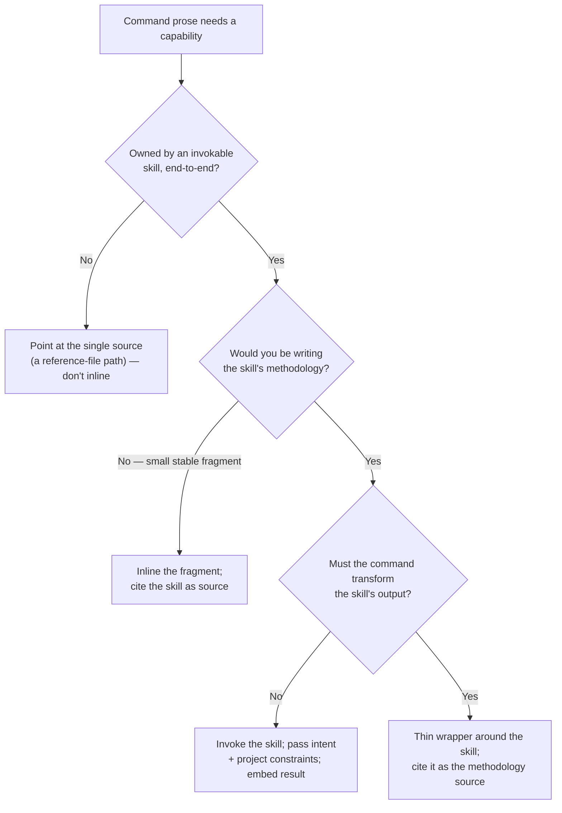

# A prose recipe that delegates to a bundled skill must invoke the skill, not paraphrase its workflow

## Problem

When a slash-command recipe needs a capability that a bundled (or globally available) skill already owns end-to-end, re-describing that skill's workflow — type selection, syntax rules, verification steps — in the command prose creates a second source of truth that drifts from the skill.

## Context

PR #15 swapped the `excalidraw-diagram` skill for the `mermaid` skill in `content-to-skill` and rewrote the diagram-generation step (Step 5c in `commands/content-to-skill.md`). The first draft of Step 5c re-enumerated the mermaid skill's own procedure: map the concept to a diagram type, read `references/<type>.md` for syntax, write the block, then verify it against the skill's parse-pitfalls table. Every one of those instructions already lived in `skills/mermaid/SKILL.md`.

`/pre-merge` Dimension 6 (docs/solutions adherence) matched this against the existing dual-consumer doc and flagged it as a partial single-source-of-truth violation. Step 5c was rewritten to **invoke `/mermaid`** with the concept plus project-specific constraints (GitHub light/dark legibility, "a handful of nodes that argue the structure"), then embed the verified block the skill returns. The command kept only what is genuinely project-specific: *when* to generate a diagram, candidate selection, the 0–2 limit, and where to embed the output.

## Symptoms

- The same procedure described in two places — the command prose and the skill's `SKILL.md`.
- Editing the skill's workflow (e.g. adding a diagram type, changing the verification recipe) silently leaves the command's paraphrase stale; nothing mechanically ties them.
- The paraphrase can diverge subtly — omit a type the skill supports, or describe a verification step the skill no longer uses.

## Root Cause

Identical in structure to the dual-consumer function/prose case (see sibling doc): two sources of truth for one procedure, where drift is the *default* state and staying in sync requires deliberate effort that is easy to miss. The only difference is the shape of the participants — here the "function" is a bundled **skill** invokable via the Skill tool (`/name`), and the "caller" is LLM-consumed command prose that can invoke it directly rather than paraphrase it.

## Learning Level

- **Level:** Pattern
- **Feedback loop or delay:** Skill edits and command-prose edits land in separate changes with no shared fast-feedback signal (no test fails, no type error). Drift accumulates silently between edits and only surfaces when a full conversion run exercises the paraphrased path — a slow, expensive feedback cycle, the same delayed-feedback structure the sibling doc describes.

## Rule Scope

- **Applies when:** a slash-command or subagent prose recipe needs a capability that an invokable skill already owns end-to-end, *and* what would otherwise be written into the prose is that skill's internal methodology (its steps, syntax, or verification). Invoke the skill; pass intent plus project-specific constraints; keep only project-specific framing (when to invoke, selection criteria, output placement, limits) in the command.
- **Inverts or does not apply when:**
  - The capability is **not** a standalone invokable skill — then point the prose at the single source (a specific reference-file path) rather than inlining or invoking.
  - Only a **small, stable fragment** is needed and invocation overhead isn't justified — inline the fragment but cite the skill as its source.
  - The command must **transform or constrain the skill's output** in a way the skill can't express — a thin wrapper is unavoidable, but it must still cite the skill as the source of methodology rather than re-deriving it.
- **Sibling docs:** [`llm-consumed-contracts-and-test-fidelity-2026-05-04.md`](./llm-consumed-contracts-and-test-fidelity-2026-05-04.md) — the dual-consumer (TS function + prose) shape of the same single-source-of-truth principle.

Routing the four branches:



## Solution

**Single source of truth = the skill. The prose invokes it and supplies project-specific intent; it does not restate the skill's procedure.**

**Before** (paraphrase that drifts from `skills/mermaid/SKILL.md`):
```markdown
3. **Generate Mermaid source** using the bundled `mermaid` skill at `${CLAUDE_PLUGIN_ROOT}/skills/mermaid`. For each selected framework:
   a. **Map the concept to a diagram type** (flowchart for processes, `stateDiagram` for feedback loops, ...). See the type table in `.../mermaid/SKILL.md`.
   b. **Read the matching syntax reference** under `.../mermaid/references/<type>.md` before writing code ...
   c. **Write the diagram** as a fenced ```mermaid block ...
4. **Verify** ... check the block against the parse-pitfalls table in the mermaid skill's `## Verification` section ...
```

**After** (invocation that can't drift):
```markdown
3. **Generate the diagram by invoking the bundled `mermaid` skill** (`/mermaid`) — do not hand-write or paraphrase Mermaid syntax. The skill is the single source of truth: it owns diagram-type selection, the strict per-type syntax references, and the parse verification. For each selected framework, invoke `/mermaid` with:
   - the concept and the relationship to show (so it can pick the diagram type),
   - the constraint that the diagram stay legible in both light and dark GitHub themes,
   - a focus instruction — a handful of semantically-named nodes that argue the structure.
   Take the verified ```mermaid block the skill returns.
```

## Prevention

**Code-level:** When a command references a capability owned by a skill, write the *invocation* (skill name + inputs to pass), not the skill's steps. Project-specific concerns (selection criteria, output location, limits) stay in the command; methodology is delegated.

**Process-level:** `/pre-merge` Dimension 6 already catches this — it caught this instance because the 2026-05-04 sibling doc existed for it to match against. Treat "command prose paraphrases an invokable skill's workflow" as the same single-source-of-truth violation class as the function/prose case, and fix it before merge rather than deferring.

## Two adjacent traps from the same PR

- **Skill-vendoring duplication.** A plugin's bundled skill, declared in `plugin.json` (`./skills/mermaid`), is the single source of truth that registers the skill. A mirrored `.claude/skills/<name>/` copy is redundant and drifts. The original `excalidraw-diagram` entry under `.claude/skills/` was a **gitlink** (a submodule pointer, zero copied files); replacing it with 32 real vendored files *introduced* a second full copy. When vendoring a skill into this plugin, keep exactly one copy (the bundled `skills/<name>/`), and remember that swapping a gitlink for real files silently converts a pointer into a duplicate.
- **Nested fences in agent-executed Markdown.** The canonical embed example wrapped a ```` ```mermaid ```` block inside a ```` ```markdown ```` block using triple backticks for both, so renderers terminated the outer fence at the first inner ```` ``` ````. Use a **four-backtick outer fence** when an example contains a triple-backtick block. This matters specifically because the prose is read and executed by an agent, so a broken example can mislead it about where the block ends.

## Planning / Calibration Notes

- **What tightened the work:** The 2026-05-04 sibling doc directly drove the pre-merge catch of the paraphrase finding — concrete evidence the `docs/solutions/` consult during `/pre-merge` Dimension 6 pays off. The compound loop is working as designed.
- **Future planning adjustment:** When a command swaps one bundled skill for another, treat "does the new step delegate by invocation or by paraphrase?" as a checklist item — the swap is the moment the paraphrase tends to creep in.
- **Actuals:** This was `/shape` → direct implementation (no PRD), appropriate for a tooling swap. Pre-merge surfaced 3 findings on a ~58-line authored diff (the rest was vendored skill content), 2 of them actionable — consistent with the sibling doc's "5–7 advisory findings, 1–2 worth fixing" baseline.

## Key Decision

**Decision:** Command/subagent prose recipes invoke skills they depend on rather than paraphrasing the skill's workflow.
**Rationale:** Single source of truth; the prose can't encode a procedure that diverges from the skill's. Mirrors the function-invocation decision in the sibling doc.
**Alternatives considered:** Point the prose at the skill's individual reference files (rejected — still paraphrases the *workflow* tying them together, and re-lists the type table). Keep the paraphrase and rely on review to catch drift (rejected — review is advisory and drift is the default state).
**Revisable:** Yes — if a future capability is *not* exposed as an invokable skill, fall back to "point at the single source file." The principle holds; the mechanism adapts.

## Related

- PR #15 — Replace Excalidraw diagram skill with Mermaid (v1.8.0)
- Sibling: [`llm-consumed-contracts-and-test-fidelity-2026-05-04.md`](./llm-consumed-contracts-and-test-fidelity-2026-05-04.md)
- The bundled skill that is now the single source of truth: `skills/mermaid/`

## Shelf Life

Stable. Holds while this project authors LLM-consumed command prose that delegates to skills. The recommendation expires only if the project stops invoking skills from command prose (e.g. moves to a model where commands import skill logic mechanically rather than via the Skill tool).
